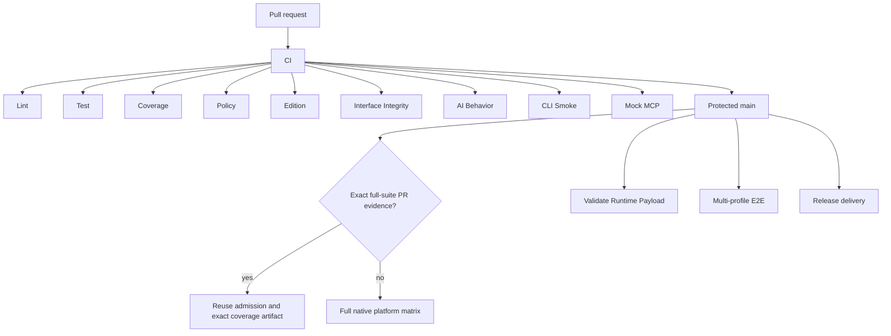

# CI — PR 合入门禁

The pull-request admission layer has exactly nine required external contexts:

| Required context | Contract |
|---|---|
| `Lint` | Stable PR revision/risk classification plus applicable formatting, `go vet`, and Actionlint |
| `Test` | Tier-selected race/unit/release-script tests plus representative cross-platform compilation |
| `Coverage` | Scope-matched overall non-regression and 100% changed-code coverage |
| `Policy` | Repository policy and the fail-closed CHANGELOG contract |
| `Edition` | Edition contract tests |
| `Interface Integrity` | CLI, Schema, Skill, and stable-release compatibility |
| `AI Behavior` | Base-owned policy for PRs labeled `ai-generated` |
| `CLI Smoke` | Offline help for every public top-level command |
| `Mock MCP` | HTTP and stdio MCP lifecycle smoke tests |

The workflow display name is `CI`. Parallel helper
jobs may implement `Test` and `Coverage`, but they are not ruleset contexts.
Do not require an aggregate alias or a downstream integration check in place of
the nine contracts above.

`AI Behavior` is evaluated by a `pull_request_target` workflow that never
checks out or executes PR code. It writes the exact `AI Behavior` status to the
current PR head. Its Files API read is bracketed by base/head revision checks,
and Ready/Draft state transitions cancel older evaluations and verify the live
state, so a synchronize or state race fails closed. A Draft revision publishes
an explicit failing `AI Behavior` status; marking it Ready first replaces that
status with `pending` and only then evaluates the normal policy. The same
workflow supplies a successful `AI Behavior` check run on protected `main`
pushes for release governance.

## Draft pull-request feedback

A Draft pull request runs the independent `Draft CI` workflow. Its single
`Draft Fast Gate` provides bounded development feedback: it verifies the
synthetic merge identity, package plan, formatting, `go vet`, Actions syntax,
reviewer routing, installer smoke, build, release-fragment lifecycle, and
lightweight repository policy.

The Draft result is not Code Admission and is never a substitute for `Lint`,
`Test`, `Coverage`, `Policy`, `Edition`, `Interface Integrity`, `AI Behavior`,
`CLI Smoke`, or `Mock MCP`. GitHub records conditionally skipped formal jobs as
successful checks, so absence alone is not a safe admission boundary. The
base-owned `AI Behavior` status therefore fails every Draft revision explicitly;
because it is one of the nine required contexts, skipped formal jobs cannot
satisfy the ruleset. Marking the pull request Ready changes that status to
`pending` before policy evaluation and starts complete tier-selected admission
on the current head SHA. Merge remains blocked until all nine contexts succeed.

Converting a ready pull request back to Draft creates a new skipped formal CI
run in the same PR concurrency group, cancelling any in-progress heavy
admission work; it also replaces `AI Behavior` with a failing Draft status and
starts `Draft Fast Gate`. A later `ready_for_review` event cancels any remaining
Draft validation, marks `AI Behavior` pending, and runs full admission again.
Editing only a Draft title or body does not consume a runner; changing its base
branch revalidates the synthetic merge.

## Exact CHANGELOG-only fast path

A pull request qualifies only when GitHub reports exactly one changed file,
that file is an in-place modification of `CHANGELOG.md`, and the base and head
both retain it as a regular non-executable `100644` blob. Add, delete, rename,
symlink, executable-mode, and second-file changes do not qualify.

`Lint` classifies the Files API result only after verifying that the API's base
and head equal the event revision both before and after pagination. `Policy`
checks out GitHub's PR merge ref and verifies its parents:

```text
HEAD^1 = pull_request.base.sha
HEAD^2 = pull_request.head.sha
```

It then runs:

```sh
./scripts/policy/check-changelog-pr.sh \
  --fast-path "$PR_BASE_SHA" HEAD
```

The exact fast path remains limited to historic one-file maintenance. A
release-seal PR uses `--content-only`, which permits the generated
`CHANGELOG.md` change together with archival moves from `.changes/` to
`.changes/released/`; it receives the normal scoped admission instead of this
fast path. Ordinary PRs must not modify `CHANGELOG.md`; they add a standalone
release fragment instead. The validator and its policy dependencies in that merge tree are byte-for-byte the current base
versions. Validation targets the synthetic merge tree, not the feature-branch
tree, so a stale branch cannot supply an older validator or combine with newer
base notes into an invalid final CHANGELOG.

All nine admission contexts are still emitted and must succeed. Expensive
implementation helpers are skipped; the named contexts record that their code
surface is unaffected.

The protected `main` push keeps that fast path only when all of these
fail-closed conditions hold:

- the event is a non-forced update of the existing `refs/heads/main`;
- the event `after` SHA is the exact workflow SHA, and both event SHAs are
  complete, non-zero commit IDs;
- GitHub's comparison reports the previous main tip as the unique linear merge
  base, with no commits behind it;
- the complete resulting tree diff is exactly one in-place modification of
  `CHANGELOG.md`;
- the previous main tip already has successful GitHub Actions checks for all
  nine Code Admission contexts.

`Policy` then independently checks out the pushed revision and runs the same
`check-changelog-pr.sh --fast-path` contract from the event's `before` SHA to
its `after` SHA. If identity, ancestry, file scope, tree mode, CHANGELOG
content, or predecessor admission cannot be proved, classification falls back
to the complete main admission suite. A source change can therefore never
inherit the CHANGELOG-only result.

Any PR that touches `CHANGELOG.md` but also changes another file runs the same
content contract in `Policy` with `--content-only`. That mode accepts only
fragment archival moves (`.changes/<name>.md` to
`.changes/released/<version>/<name>.md`) alongside the changelog; source and
documentation changes are rejected. It still rejects invalid dates or
versions, missing bullets, placeholder `TODO`/`TBD`, unmanaged-section
changes, and unsafe tree modes.

## Exact admitted-merge reuse on main

Pull requests and protected `main` pushes remain separate GitHub trust events,
so all nine required contexts are still published for both SHAs. For an
ordinary merge whose final tree is identical to the already admitted PR head,
the protected-main run may reuse that exact admission only when the PR already
executed the complete coverage suite. It then avoids executing the same
expensive suites again. This changes work performed inside the existing jobs;
it does not add a new job or weaken the branch ruleset.

The classifier fails closed unless it can prove every one of these facts:

- the push is a non-forced update and the workflow SHA equals the event's exact
  `after` SHA;
- the new commit is a standard two-parent merge whose first parent is the event
  `before` SHA and whose second parent is the admitted PR head;
- exactly one closed PR binds that head, the `main` base, and the merge commit;
- the merge commit tree and PR-head tree are byte-for-byte identical;
- `.github/workflows/ci.yml` and
  `.github/workflows/ai-behavior-check.yml` have the same Git blobs on the
  previous main tip and the PR head, so a PR cannot redefine a check that
  authorizes its own reuse;
- the PR head has successful latest GitHub Actions checks for all nine required
  Code Admission contexts, all completed before merge;
- the base-owned `AI Behavior` status targets that exact PR URL, and its
  `pull_request_target` workflow run binds the same head repository, branch,
  SHA, and pre-merge completion time;
- exactly one successful, completed `pull_request` run of the protected `CI`
  workflow binds the eight CI-owned contexts to that PR head before it merged;
- all five complete current-coverage shards plus supporting coverage completed
  successfully in that same run, proving this was not a scoped profile;
- that run owns exactly one non-expired `coverage-report` artifact with a
  published SHA-256 digest and the same head SHA; the archive's admission
  manifest independently binds the run ID, head SHA, and `full` profile kind.

Merged-PR discovery tolerates GitHub's commit-to-PR association index lag. A
protected-main push fires within seconds of the merge, and a single-shot
association lookup was observed returning zero matches for eligible merges in
production, silently forcing the complete suite. The classifier therefore
re-polls discovery on a bounded budget (`DWS_ADMITTED_MERGE_RETRY_ATTEMPTS`
attempts, `DWS_ADMITTED_MERGE_RETRY_INTERVAL_MS` apart; twelve attempts at
five seconds by default) and additionally consults the most recently updated
closed `main` PRs under the identical exact filter, because the merge
transaction records `merge_commit_sha` on the PR before the push event fires.
Only zero-match discovery retries; an ambiguous or mismatched result throws
immediately, and an exhausted budget keeps the complete protected-main suite.

When those facts hold, `Lint` publishes the bound PR head, run, artifact, and
digest. The existing `coverage-main-metadata` job downloads the artifact by
numeric ID, revalidates its API identity, verifies the downloaded archive's
digest before extraction, validates the manifest and `coverage.txt`, and saves
the profile under the exact merge SHA cache key. A lookup-only restore must
then observe that exact key. `Test`, `Coverage`, `Policy`, `Edition`,
`Interface Integrity`, `CLI Smoke`, and `Mock MCP` still report their stable
required names while explicitly recording or verifying the reused admission;
base-owned `AI Behavior` remains independent.
The non-ruleset `Validate Runtime Payload` helper still executes on the merge
SHA because that protected-main validation is not guaranteed to have run on
every full-suite PR.

Any missing, duplicate, stale, or mismatched API evidence keeps the existing
complete protected-main suite. If an already-bound artifact later cannot be
downloaded or fails its digest, manifest, or profile validation, the existing
main-cache helper recomputes the complete coverage profile authoritatively
instead of promoting those bytes. Squash/rebase merges, stale branches whose
merge tree differs, direct pushes, and PRs that modify the CI workflow are
therefore ineligible. A standard PR that ran only scoped coverage is also
ineligible because it cannot populate a complete future merge-base profile.
In particular, the governance PR that introduces or changes this mechanism
must itself run the complete post-merge suite; only later eligible source
merges can use the optimization.

## Fail-fast cancellation on pull-request runs

The first substantive job failure in a pull-request admission run cancels the
whole run, so already-doomed siblings stop consuming hosted runners and
concurrency slots while the author iterates. Cancellation is implemented by
one `fail-fast-*` tripwire helper job per watched job: a job-level `needs`
evaluates only after every watched job completes, so a shared watcher could
not react to the first failure, while a dedicated tripwire fires the moment
its own job fails. Matrix jobs react after their last leg completes; the
matrix `fail-fast: false` contract is deliberately preserved so every broken
shard still reports in one run before the tripwire cancels the remainder.

Each tripwire also depends on `lint` directly and fires only after a
successful lint classification, so the Draft-gated lint job remains the
single admission entry point: a failed lint already skips every dependent
job, and Draft revisions never reach a tripwire.

Tripwires are scoped to `pull_request` events. Protected-main pushes run to
completion: they are the coverage-cache producer and need the full failure
picture for post-merge triage. `lint` is exempt because its failure skips
every dependent job anyway; `coverage-main-metadata` is exempt because it is
push-only.

A cancelled admission run still fails the nine required contexts — a
cancelled or skipped check is not a success — so fail-fast can never authorize
a merge; it only reclaims wasted work. Tripwire check runs are helper
contexts outside the ruleset.
`TestCIFailFastTripwiresWatchEverySubstantiveJob` derives the watched set
from the live job graph, so a new substantive job without a tripwire, or a
tripwire orphaned by a removed or exempted job, fails the workflow contract
tests.

## Risk tiers and downstream boundaries

`Lint` resolves the complete base/head diff before any helper is skipped.
Unknown or truncated input fails closed into the high-risk tier.

| Tier | Selection | Admission work |
|---|---|---|
| Documentation-only | Only prose/documentation assets; no executable, generated, workflow, packaging, or interface surface | Documentation and repository-asset validation; expensive code helpers skip while every required context still succeeds |
| Standard | Ordinary code change with a stable package graph | Race tests for changed Go packages and their reverse dependencies; candidate and merge-base coverage over the same impacted scope and `coverpkg`; representative Darwin/Windows compilation |
| High-risk / unproven protected `main` | Workflow/policy, package add/remove/rename, generated Schema/registry, platform, auth/keychain, installer, packaging, release, transport, recovery, or a protected-main revision without exact admitted-merge evidence | Complete race suite and full native macOS/Windows tests, plus every affected domain gate |

Domain helpers (`Edition`, `Interface Integrity`, `CLI Smoke`, and `Mock MCP`,
for example) execute their substantive suites when the diff can affect that
contract or when the high-risk tier is selected. Otherwise their stable named
contexts still report a successful, explicit unaffected result. Release-script
tests follow the same impact rule. This preserves the ruleset contract without
charging every developer for unrelated work.

Platform-sensitive changes additionally run native changed-code coverage. A
protected-main revision without exact admitted-merge reuse always runs native
tests; eligible merges retain the native evidence already recorded on the PR
head. Generic portable changes are held to the Linux changed-code gate rather
than being forced to manufacture platform-only coverage.

Complete `Multi-profile E2E` is not a PR admission context. It belongs to the
`Main Integration — 主干集成` workflow and runs only after a push to `main` (or
an explicit manual dispatch). A failing downstream run remains a real
regression and must be repaired, but it must not be represented by a synthetic
successful PR check. The workflow executes the isolated profile storage,
routing, migration, and aggregation chain without repeating the complete
`internal/auth`, `internal/app`, and `test/cli` package suites. Those Go
regressions remain owned by the protected-main test and coverage shards. The
release E2E validation uses the same boundary so release verification does not
duplicate an already admitted commit's complete Go suite.



## Review ownership and auto-merge

A base-owned `pull_request_target` workflow routes newly opened, updated,
reopened, or newly ready PRs targeting `main` to one eligible peer reviewer. It
does not check out or execute PR code, excludes both the author and the known
latest pusher, and balances the open requested-review load across the reviewed
maintainer pool. A current-head approval or change request is preserved; after
a new push, stale activity does not suppress a fresh request, and an
outstanding change requester is preferred for continuity.

The branch rulesets keep one human approval and all nine strict required
contexts, require someone other than the latest pusher to approve after the
most recent head update, and restrict `main` updates to the dedicated Reviewer
Router App in pull-request mode plus the designated Formula publishers and
break-glass identities. Repository auto-merge is enabled for ready PRs, so the
App-owned request records the automation intent while the App's synchronous
merge path waits for that approval and the current revision's nine green
checks. If `main` advances, strict checks rerun before merge. The
reviewer routing job uses the built-in `GITHUB_TOKEN` to request reviewers with
`Contents: read` and `Pull requests: write`. A separate base-owned cleanup job
isolates the merge-authority permissions (`Contents: write` and `Pull
requests: write`), checks out only the exact event base policy, and revalidates
the live event base/head. Before reading App credentials, its built-in token
normalizes every request that is not already owned by the reviewed App with the
fixed headline/body, rejects workflow-skip metadata, and proves that the exact
repository-owned `main-merge-writers` rule denies that token any bypass. It
never enables auto-merge. A PR that changes `.github/workflows/**` is an
explicit manual-only case: the trusted step skips App token minting and
auto-merge enablement instead of granting the App `Workflows` permission, and
reconciliation clears any older App-owned request rather than merging it. Any
authority failure clears a remaining request and
leaves the PR manual-only. The job then mints a current-repository installation token
for the dedicated Reviewer Router GitHub App, proves its emitted slug matches
the reviewed `REVIEWER_ROUTER_APP_SLUG`, rechecks the App-side ruleset boundary, and
enables native auto-merge with fixed metadata. This
identity boundary is required because GitHub suppresses
most workflow events created by the built-in token; using it for auto-merge would
silently skip the merge commit's protected-main CI and baseline-cache
producer. Token minting or takeover fails closed without falling back to
`GITHUB_TOKEN`: every non-reviewed request is cleared before credentials are
read. During the staged migration away from metadata-triggered full admission,
the required `Test` context independently repeats the same built-in-identity
check as a shadow assertion. GitHub's read APIs may omit `parameters` for the strict
`update_allows_fetch_and_merge: false` value, so the gate accepts only that
exact omission or a one-field `parameters` object containing explicit boolean
`false`; every other present shape or value fails closed. The gate then binds
the same ruleset node through GraphQL and requires its non-null
`updateAllowsFetchAndMerge` value to be exactly `false`. It also requires its
own built-in token to report
`current_user_can_bypass: never`. The minted App separately requires
`pull_requests_only` on that writer rule and `never` on every other active main
ruleset before it can enable, reconcile, or synchronously merge. The read-only
`Test`
token may receive a repository projection with both merge-default properties
omitted; it accepts only that complete omission or exact `MERGE_MESSAGE` plus
`PR_TITLE`/`BLANK`, while partial or malformed projections fail closed.
The same unprivileged `pull_request` job may receive an empty repository-variable
projection for an external fork. Only when the event head repository differs
from the base repository does it substitute the exact reviewed public slug
`dingtalk-dws-reviewer-router` for identity comparison. An empty variable on a
same-repository PR and every malformed non-empty value still fail closed. This
fallback neither mints a token nor grants merge authority; the base-owned
Router continues to require its minted App slug to equal the repository
variable before any mutation. The minted App's `Contents: write` token must
observe the exact reviewed defaults
before either mutation path proceeds. GitHub hides the complete
`bypass_actors` list from low-privilege callers, so the rollout audit must still
keep the writer list at exactly the Reviewer App, `haofeng0705` (ID
`30925823`), and `PeterGuy326` (ID `47820304`). The required check finally
accepts a null or exact App-owned
request after a short takeover grace period. Null is safe from the suppressed
event path because the built-in Actions identity cannot update `main`; other
permitted identities produce either a main push or the trusted closed-PR
repair. Drafts skip the identity step, while `ready_for_review`, `edited`,
and revision events explicitly start fresh admission for readiness, title, and
code changes. `auto_merge_enabled` wakes only the lightweight base-owned
Router; because it does not change the head SHA, it reuses the existing nine
admission results instead of restarting the full graph. Neither CI nor Router
reacts to `auto_merge_disabled`, so a human can deliberately leave the PR
manual-only for break-glass handling.
Reviewer routing remains available. The protected-main push that deploys the
workflow automatically migrates every open, ready non-App request and repairs
unsafe App metadata; it disables workflow-skipping requests for correction.
Because GitHub's deferred native auto-merge path does not reliably apply an
App's pull-request-only ruleset bypass, a zero-permission approval-signal
workflow and completed `CI` / `Code Admission — AI Behavior` workflows wake the
same trusted default-branch reconciliation through `workflow_run`. That event
is only a wake-up signal: the privileged job does not consume its pull-request
payload or artifacts and does not check out the triggering run's code. It
re-enumerates open `main` PRs through the API and attempts only an exact
App-owned request through the synchronous PR merge endpoint. Immediately before
each attempt it revalidates the App's ruleset boundary and PR intent, supplies
the current head SHA, and treats server-declared not-ready or
concurrent-revision responses as retriable. An exact behind-main state is also
retriable before the merge request. The exact transient pair
`mergeable=null` and `mergeable_state=unknown` is likewise deferred without a
merge request; it is not treated as evidence that the PR is admissible.
`mergeable=false`、`dirty`、`draft` 及缺失的 `mergeable` 同样提前延后。
`mergeable=true + blocked` 不会被一律跳过：主干写入限制可能使这个状态持续存在，
因此仍由 App 尝试同步合并，让 GitHub 强制执行审批和必需检查。
精确的 HTTP 403 `Resource not accessible by integration` 只有在同一 App
重新读取并证明 PR 仍打开、head 未变、目标仍为本仓库 `main`，且状态为 `behind`、
`true + blocked` 或原有显式不可合并状态时才可重试；其他 403 仍为失败。
The live preflight requires the
exact repository-owned approval ruleset and exact nine-check strict quality
ruleset, with every context bound to the GitHub Actions App
(`integration_id=15368`) and the Reviewer Router App unable to bypass either;
a missing, disabled, incorrectly sourced, or weakened gate fails closed before
merge. GitHub—not the workflow—decides whether the
merge is admissible. A staggered twice-hourly schedule provides eventual
recovery, and a manual `workflow_dispatch` from `main` is the immediate
idempotent retry path.
Reconciliation never enables an originally null request. The reviewer router
is orchestration, not a quality context, and
must not be added to the ruleset.

Disabling the App-owned request before the reconcile job's final PR read keeps
the PR manual-only. GitHub can atomically bind the subsequent merge to the head
SHA, but it cannot bind that call to the auto-merge intent; a disable racing
after the final read may therefore lose to the in-flight merge. Closing the PR
or changing its head blocks the attempt only if GitHub observes that state
before accepting the merge endpoint call; no client-side action can revoke a
merge that the server has already accepted.

The merge endpoint has no expected-base precondition. Reconciliation checks
that the base is this repository's `main` immediately before and after the call,
but a retarget racing after the final read is not atomically preventable in the
workflow. Operators must disable the App-owned intent and wait for all running
`Reviewer routing` reconciliation jobs to finish before retargeting a PR; a
stronger adversarial guarantee requires a GitHub-side branch/ruleset control.

GitHub may omit `pull_request_target` for security-sensitive head branch names,
including names that look like commit SHAs. Those PRs cannot use Router App
takeover or the closed-event repair: rename the branch for the supported path,
or use the designated break-glass identity with a safe final message so main
push CI remains the exact-SHA producer.

## Running focused gates locally

Run the contracts relevant to the change. Ordinary contributors are not
expected to repeat every CI job locally:

```sh
make build
make policy
make interface-integrity BASE_REF=<merge-base> STABLE_REF=<stable-tag> CANDIDATE_REF=<candidate-sha>
make schema-compatibility BASE_REF=<merge-base> STABLE_REF=<stable-tag> CANDIDATE_REF=<candidate-sha>
make skill-command-integrity
make cli-smoke
make mock-mcp-smoke
go test -v -count=1 ./pkg/editiontest/...
```

CI 先解析并核对精确的 merge-base、最近可达且未撤回的 stable GA tag 和已提交的 candidate
SHA，再调用 `make authoritative-interface-integrity`。本地 `make interface-integrity`
与该 CI target 都只委托给同一个 modern authoritative wrapper，不存在第二个比较
入口。省略 `BASE_REF` 时本地 target 默认比较 `origin/main`，省略 `STABLE_REF` 时自动
选择该 base 可达且未撤回的最近 stable GA tag，省略 `CANDIDATE_REF` 时比较已提交的 `HEAD`。
需要逐字复现某次 CI 时，应显式传入该次运行记录的 merge-base、stable tag 和
candidate SHA。

`make update-interface-baseline` / `make reset-interface-baseline` 只维护
`test/fixtures/cli-interface-baseline.txt` 这一份非权威 CLI Smoke fixture。底层旧
`check-interface-baseline.sh` 不再作为本地或 CI 的兼容性审批入口，也不能用于批准
flag 迁移。

The race suite keeps nine reviewed `internal/app` test-name partitions but
dispatches them through three balanced physical lanes. Each partition remains
an independent Go test process, so process-global command registries are
released between partitions; the lane is only the hosted-runner scheduling
unit. `scripts/ci/run-app-race-tests.sh` owns both the partition set and the
lane map, and the workflow contract proves that each focused/full-suite matrix
contains exactly those three lanes and that their union contains every
partition exactly once.

The initial lane balance is evidence-based rather than alphabetical by job.
Across 11 successful full-suite runs sampled on 2026-09-03, replaying the
recorded partition step durations produced a slowest-lane median of 8m53s,
p90 of 9m02s, and maximum of 9m08s. The 20-minute job timeout remains unchanged
as regression headroom. The scheduling model predicts 33 to 27 successful jobs
per ordinary full-suite PR and about 40-50 seconds lower completion time for the
last PR when two to four full suites arrive two minutes apart. These are rollout
targets, not post-change measurements; maintainers must validate them against
live overlapping runs and rebalance the helper-owned lane map if the slowest
lane p95 exceeds 12 minutes.

Schema compatibility 使用同一组 base、stable、candidate refs，以及 base-owned flag
与 command migration ledgers。merge-base-owned checker 分别规范化 merge-base 与
stable 的完整 Schema，并让 candidate 对两份历史 contract 独立执行检查；它只把已通过
Interface lifecycle 的 exact rename、command move 或 flag extraction 规范化到当前历史
副本，不会维护第二份 allowlist，也不会放宽其他 Schema 历史字段。

For a release-seal branch that archives rendered fragments:

```sh
base_ref=$(git merge-base HEAD origin/main)
./scripts/policy/check-changelog-pr.sh --content-only "$base_ref" HEAD
```

`make coverage-gate` is an enforcement step, not a profile generator. For a
standard PR, CI derives changed packages and their reverse-dependency test
closure, then generates candidate and merge-base profiles with the same test
scope and `coverpkg`. High-risk and protected-main runs without exact
admitted-merge reuse use the complete profiles. The complete candidate profile
is produced by five fixed per-shard
helper jobs (`scripts/ci/test-packages.sh list-coverage`; `verify`
proves the shard union equals the full-suite scope exactly once). Packages
remain serial within each runner except for the large `remaining` shard, which
uses fixed package parallelism `-p 2` to overlap its two independent long tails
without requesting another runner. The `internal/app` package is handled
separately: it reuses the existing reviewed test-name partitions and balances
them across the same five coverage jobs, so each partition gets a fresh Go test
process and releases process-global command registries. The assignment is
validated in both directions and reduces the long tail without requesting
another hosted runner. The partition and final shard profiles are
deterministically unioned by source block before enforcement. This does not add
matrix jobs. The same bounded in-job runner owns every trusted cold full-profile
fallback, so PR baseline, metadata promotion, Formula promotion, and repair do
not reintroduce the long-lived app process. The complete merge-base profile is
restored from an exact-key
cache written by the last green `main` push of that same commit (key:
merge-base SHA plus resolved Go version); any miss falls back to recomputing
it in a merge-base worktree. The trusted `main` producer and PR consumer use
the same dedicated cache profile path because GitHub includes that path in the
cache version; the runtime-facing candidate and baseline filenames remain
separate. Near-miss reuse is forbidden — the caches carry no prefix restore
keys, because a neighbouring commit's profile would compare the candidate
against the wrong baseline. PR concurrency is keyed by PR number, so a later
revision cancels the stale run instead of letting obsolete test matrices
compete with the replacement for hosted runners. If cancellation interrupts a
cold-cache fallback, the latest run recomputes the same exact merge-base
profile authoritatively. Main concurrency remains keyed by pushed SHA, so a
newer main push cannot cancel a predecessor's producer.

Every supported main advancement path has an exact-SHA producer. The required
`Test` context rejects GitHub workflow-skip directives in PR and auto-merge
metadata, reruns when that metadata is enabled, disabled, or edited, and
verifies the live App/writer-ruleset identity contract. Reviewer Router
additionally binds auto-merge to the exact head OID and writes a fixed safe
merge headline/body. The sole break-glass publisher must retain a safe final
message; the release-controlled Formula-only path
is the sole supported use of `[skip ci]`. A source push that cannot prove exact
admitted-merge reuse saves the newly assembled profile after the aggregate gate
passes. An eligible tree-identical merge instead verifies and promotes the
bound PR run's immutable coverage artifact to the exact merge-SHA key. A trusted
documentation or release-seal push independently verifies that the complete
`before...after` diff contains only the reviewed metadata allowlist, restores
only the exact `before` cache, recomputes the full profile if the chain is
cold, and makes that helper a dependency of the required `Coverage` context.
Release-generated Formula commits intentionally retain `[skip ci]`; after
their nine synthetic contexts are sealed, an independent release-governance
job creates an acknowledgement and emits a `coverage-baseline-promote`
repository dispatch. The default-branch promotion
workflow revalidates the exact single-parent Formula identity, successful
parent and target contexts, and main containment before it promotes the exact
parent cache or performs the same full fallback. Every target-main producer
follows its save with a lookup-only restore and requires
`cache-hit=true` for the exact key; this turns the cache action's otherwise
warning-only upload failure or prefix match into a hard failure. Formula
promotion additionally updates one release-created `Coverage Baseline Cache`
check. A separate confirmation job waits for that exact check-run ID while npm
and mirrors remain dependent only on the immutable publication job; cache
failure therefore makes the final delivery gate red without creating a
partially published release. Once Formula sealing exposes its SHA, a later
publication verification failure cannot suppress that confirmation job.

A separate base-owned `pull_request_target: closed` safety net covers the final
merged SHA even if a human or integration changes the merge message after PR
checks finish. Skip directives alone do not suppress `pull_request_target`,
subject to GitHub's separate security-sensitive branch-name restriction above.
That job executes no PR code and only dispatches after binding the exact
closed-event PR number and stable head SHA to merged-PR facts
(`merged_at`, `base.ref`, and `merge_commit_sha`) and proving `main`
containment. It does not compare the later REST `base.sha`, which follows the
live base branch after merge. Because GitHub makes default-branch caches
read-only to `pull_request_target`, the dispatcher first waits up to one minute
for a run from the exact protected
`.github/workflows/ci.yml` workflow and exits when that normal producer exists.
A successful main CI hard-verifies the exact key itself. A completed
non-success run starts a separate base-owned `workflow_run` dispatcher, which
binds the exact CI workflow ID/path, run ID/attempt, conclusion, upstream
repository, `main` branch, and head SHA. That trigger is also cache-read-only,
so either trusted dispatcher uses `repository_dispatch`; its producer
revalidates the merged-PR or failed-CI identity, checks out the contained SHA,
and produces/verifies the exact full cache.
An hourly schedule and a main-only manual dispatch repair the event-time main
SHA after a direct break-glass push or cache eviction. The dispatch exception
is intentional: unlike an ordinary event created by `GITHUB_TOKEN`, GitHub
allows `repository_dispatch` to start another workflow. A legacy built-in-token
merge can suppress the closed event too, which is why the required `Test`
identity gate and dedicated Reviewer Router App are still mandatory.

A cold miss can still occur during a producer race or after cache eviction,
but it remains fail-safe: the PR recomputes the authoritative baseline with a
30-minute job budget and saves a PR-scoped copy for same-PR reruns. It is no
longer possible for a supported main-advance path to omit its producer
silently. That PR-scoped fallback save remains a best-effort acceleration and
does not replace the normal push, metadata, Formula, and merged-PR repair
producers. Supporting and (when
platform-selected) native profiles are generated before the aggregate
`Coverage` context evaluates them. The
aggregate and native gates require 100% coverage for changed executable Go
statements. Overall coverage remains an unrounded, zero-tolerance,
scope-matched merge-base non-regression check. Candidate and baseline profiles
are evaluated by the same block-deduplicating checker; supporting policy and
shortcut profiles contribute to changed-code coverage only. The checked-in
badge is presentation only and is never read as a gate input.

CLI 兼容检查只使用 modern Interface Snapshot 这一处权威比较 seam，并从 PR
merge-base 和最近的可达 stable release 生成权威快照。本治理机制合入后，
merge-base 拥有生成器、比较器和已审批迁移清单，因此 candidate 不能通过修改
helper、fixture 或在同一 PR 新增 self-approval 记录来放行 breaking change。首次
bootstrap 仍由 merge-base 已有的 modern helper 做无豁免比较，并只接受 candidate
提交中的规范空清单；完整边界见下方治理文档。

精确的两阶段 flag 迁移生命周期见
[CLI flag 兼容迁移治理](cli-interface-flag-migrations.md)。治理 PR 只能在
surface 未变化时新增 `pending`；后续产品 PR 达到审批的精确 surface 后，才能
消费 base-owned 记录并改为 `consumed`。在 main 与 stable 都达到 after 状态前
必须保留该回执，之后再由单独 PR 清理。机制只放行记录中的 legacy
visible-to-hidden，以及 canonical required 新增或提升；删除、type、scope、
shorthand、no-opt 和任何无关漂移仍然阻塞。Schema 可以新增；历史 product、
tool、parameter、mapping、positional execution、constraint 与 safety 语义继续
受保护。`alias_of` 只是一项由 `FlagSpec.Aliases` 产生的框架关系证据，不是 payload
等价证明；产品 PR 仍须证明 canonical 与 legacy 的最终运行 payload 等价并在 transport
前拒绝冲突输入。当前迁移清单为空，不授权 PR #904。

## Required GitHub repository settings

The `main` quality ruleset must enable strict required-status-check policy
(`strict_required_status_checks_policy=true`) so a PR is revalidated whenever
`main` advances. Every entry must select the GitHub Actions App
(`integration_id=15368`), not “any source”. It must require these exact
context/source pairs and no legacy aliases:

- `Lint`
- `Test`
- `Coverage`
- `Policy`
- `Edition`
- `Interface Integrity`
- `AI Behavior`
- `CLI Smoke`
- `Mock MCP`

Do not require helper jobs, `Multi-profile E2E`, or an aggregate admission
alias. Update ruleset contexts only after the new names have appeared on the
protected branch, so a rename cannot silently remove enforcement or leave an
unproducible required context.

The branch ruleset also requires one approval after the latest push. Enable
repository auto-merge and automatic head-branch deletion; keep the base-owned
reviewer router outside the required-context list. Install its dedicated
GitHub App only on this repository with `Contents: read and write` and `Pull
requests: read and write`; do not grant Actions, Workflows, or Administration.
Give it pull-request-only bypass on `main-merge-writers` and no bypass on any
other ruleset. Store the App client ID and lowercase slug in repository
variables `REVIEWER_ROUTER_APP_CLIENT_ID` and `REVIEWER_ROUTER_APP_SLUG`, and
its private key in repository secret `REVIEWER_ROUTER_APP_PRIVATE_KEY`. Do not
reuse release, Homebrew, or personal tokens for this boundary.
